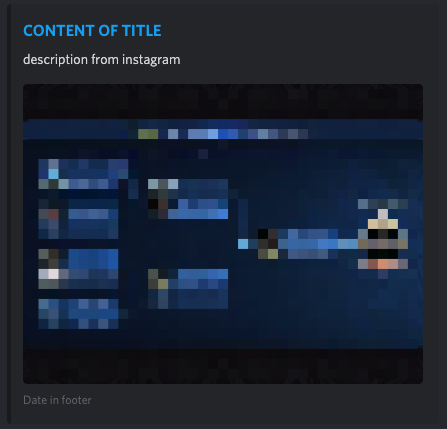

# Prerequisites #

A Linux/Windows/OSX server that's always running. (I host this program on a free google cloud debian server)

A Discord Webhook (see info [here](https://support.discord.com/hc/en-us/articles/228383668-Intro-to-Webhooks))

# Running with docker #
Just pull the image and mount a volume into ``/data`` directory to keep latest state of processes posts.
If you miss this volume it's not that important. If you restart the container the latest post get posted again.

### Environment variables
| Variable  | Usage |  Default |
| ------------- | ------------- | ------------- |
| ACCOUNTS  | names of accounts to fetch | monkeegfx,instagram |
| WEBHOOKID  | Take the ID and token out of the webhook URL | empty |
| WEBHOOKTOKEN  | Take the ID and token out of the webhook URL | empty |
| TITLE (optional)  | title upwards of the image | Instagram posted |
| DATEFORMAT (optional) | used with momentjs to display date in footer | dddd, MMMM Do YYYY, h:mm:ss a |

# Running manually #

Install node.js (Download [here](https://nodejs.org/en/ "NodeJS"))

Navigate to the install folder with `cd`

Run the command `npm install`

Replace each line in `config.json` in a text editor with the accounts you wish to monitor.

Run `bot.js`
(Optionally with something like PM2)

You're good to go!
